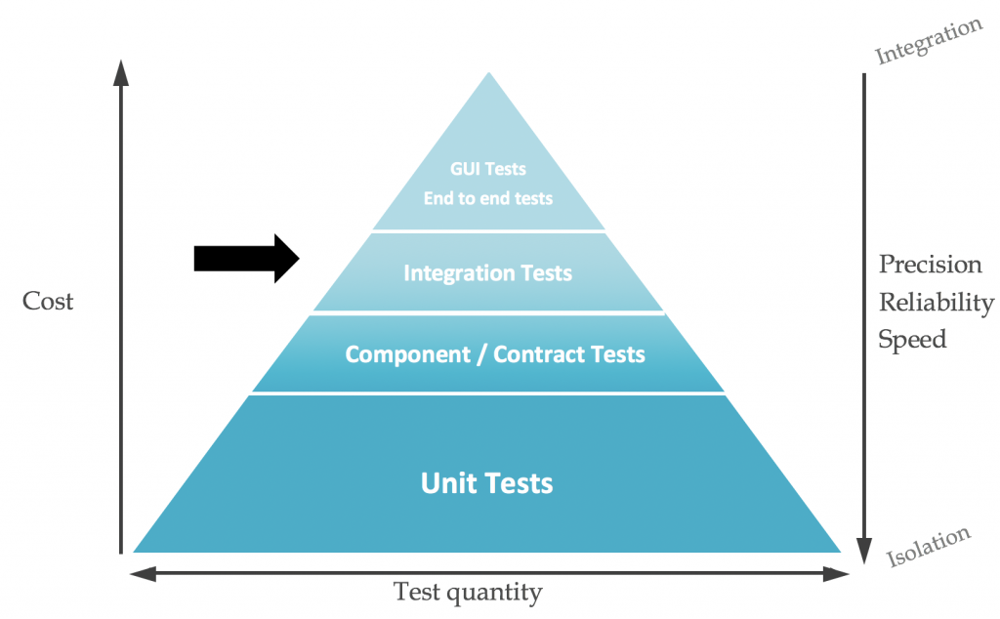

# Best Practices

## Step Execution

Run as many steps in parallel as possible.

## Testing

Division of the test cases: test pyramid

Image from [Le Blog des Octos](https://blog.octo.com/en/the-test-pyramid-in-practice-5-5/)

## Container Plattform

### Container Build

Changes made for the container (images themselves or manually installed software) have to pass the same pipeline as the application code itself.

* limit number of commands / lines inside the Dockerfile
  * this will reduce the numbers of layers
  * this will reduce the size of the Container Image
* [Docker best practices](https://docs.docker.com/develop/develop-images/dockerfile_best-practices/)
* [OpenShift image creation best practices](https://docs.openshift.com/container-platform/latest/openshift_images/create-images.html)
