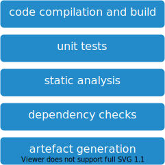

# build and unit tests

## Overview

This stage contains the classic application build.
It is enriched with further analysis and checks.

## Steps

1. code compilation and build
2. unit tests
3. static analysis
4. dependency checks
5. security checks
6. artefact generation

### code compilation and build

* build the code

Any build failure must stop the pipeline. This to provide fast feedback.

### unit tests

* run all unit tests
* collect test results
* collect test coverage

Failing unit tests will not stop the execution of the step.
This to collect the test results of all tests at the end of the step.
Any non passing test must change the status of this step to unstable.

Stop the pipeline if the step status returns unstable (failing unit tests).

Testing guidelines: [test pyramid](../../best-practices.md#testing)

### static analysis

Static code analysis (SCA) of the software source code.

* static code analysis
* Static Application Security Testing (SAST)

More details and tool suggestions: [static-analysis.md](static-analysis.md)

### dependency checks

* check dependencies for updates
* check dependencies for security problems
* license checks

More details and tool suggestions: [dependency-checks.md](dependency-checks.md)

### security checks

* Dynamic Application Security Testing (DAST)

More details and tool suggestions: [security-checks.md](security-checks.md)

### artefact generation

Packaging of the artefact.

## Stage Output

The output will be:

* application artifacts
* test results
