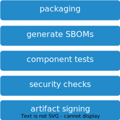

# Packaging

## Overview

In this stage the application is packaged for deployment and tested as a whole.

## Steps

1. packaging
2. component tests
3. security checks

### packaging

When deploying to a Container Plattform, this step includes a container build.

More details and tool suggestions: [packaging.md](packaging.md)

### component tests

The goal is to check that all the units of the application work together as expected. External resurces are symulated/mocked (e.g. in-memory data base).

* run component tests

Testing guidelines: [test pyramid](../../best-practices.md#testing)

### security checks

Security scan of the deployable artefact.

This mostly only applies for Docker Container.

More details and tool suggestions: [security-checks.md](security-checks.md)

## Stage Output

The output will be:

* deployable artefact of the application
  * e.g application container image
* test results
