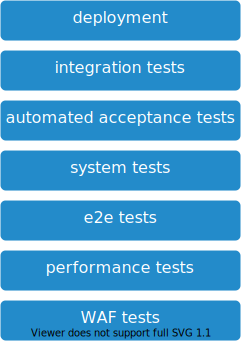

# automated tests

The application is deployed to a test environment and thoroughly inspected using automated tesing. This is the first time the application will be deployed into an environment with connectivity to other components.

## Overview

## Steps

1. deployment to test environment
2. integration tests
3. automated acceptance tests
4. system tests
5. e2e tests
6. [WAF](https://en.wikipedia.org/wiki/Application_firewall) tests

## Stage Output

Passing this step means that the deployable artefact from the [packaging stage](../02-packaging/README.md) is ready to be tested from a tester.

The output will be:

* test results
