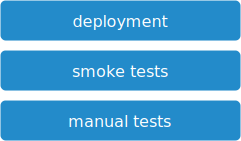

# manual tests

This optional stage is used to test borderline cases which can not accomplished with automated tests

## Overview

## Steps

1. deployment to [uat](https://en.wikipedia.org/wiki/Acceptance_testing) test environment
2. automated smoke tests

    non-exhaustive tests to ensure that the most important functions work

## Stage Output

Passing this step means that the deployable artifact from the [packaging stage](../02-packaging/README.md) is ready to deployed to production.

The output will be:

* Test report
