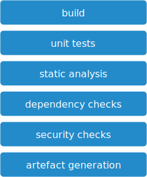

# build and unit tests

## Overview

## Steps

* code compilation and build
* Unittests
* Static Application Security Testing (SAST)
* Dependency Check
* OWASP Dependency Check
* licence checks
* Dynamic Application Security Testing (DAST)
